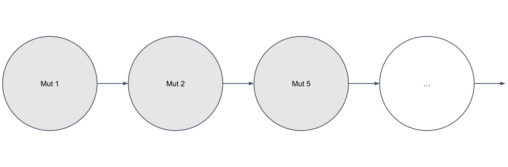

We're excited to introduce **Sampling-MetMHN**, a fast approximate MHN[1] framework that models both primary tumors and metastases. 

To the best of our of our knowledge, it is one of the first cancer progression models that manages to model the genetic progression of primary tumors and metastases simultaneously. We show that it is able to recover some of the key findings documented in pancreatic cancer literature as well as promote potentially new genomic interactions. 

Metastatic cancer progression 
=================

The term metastatic cancer refers to the systematic spread of cancer from the initial tumor site to different areas of the body[2]. We often refer to the tumor in the initial tumor site as the primary tumor and the tumor that colonized in other areas as metastasis or secondary tumor. The metastatic spread of cancer is a process that involves multiple steps. For metastasis to occur, cancer cells typically need first to leave their primary site, then enter and circulate in the bloodstream, enduring the pressure in blood vessels, and ultimately, they have to acclimate to the new microenvironment of the secondary site while surviving the pressure imposed by immune cells[3][4].

Metastatic cancer progression is highly selective and often organ-specific. In cancer patients, large numbers of cancer cells are released into the circulation system on a daily bases. However, only less than 0.1% of tumor cells establish metastatic secondary tumors[5]. It has also been established that the preferential outgrowth of metastases in organs such as the lung, liver, bone and brain is largely due to the presence of microenvironments within these organs that contain special components promoting metastasis. 

One of the most widely acknowledged theories about the destinations of metastatic cells and how metastatic progression is an organ-specific process is the seed and soil hypothesis[6]. Paget noticed that in nature, when plants go to seed, their seeds are carried in all directions, but the seed can only grow if it lands on congenial soil. Drawing an analogy from this observation, the seed and soil hypothesis suggests that cancer cells from the primary tumor (the seed) can spread to different parts of the body. However, these cancer cells can only suceed in colonizing if the microenvironment on which they land is pleasant. 

Existing models of metastatic cancer progression
=======

Existing models of metastatic cancer progression can be categorized into two classes. The first category models metastatic cancer progression as a growth model and these models do not focus on the genomic side of metastatic cancer progression. The second category is genomic models, where the interactions of genomic events are considered. One particular subtype of genomic models is the logical models where they utilize regulartory networks that are constructed from published literature. These regulartory networks describes the interactions between nodes of the model (genomic events) and using these regulartory networks, these models define a list of specific logical rules for each genomic event. Although these models are able to model interactions between genomic events, they face scalability issues. If the model needs to be expanded to include additional events, we would have to consider updating every one of the logical rules manually. Moreover, potentially essential interactions between nodes can be missed due to a lack of literature support. 

In an effort to overcome the drawbacks of the existing models, we propose Sampling-MetMHN, a genomic model that builds on existing cancer progression models developed for primary tumors but adapted to be able to model both the primary tumors and metastases. It is both scalable and able to model the interactions of genomic events. 

MetMHN: A cancer progression model that works on metastasis
==================

## The base: Mutual Hazard Networks

Sampling-MetMHN is based on Mutual Hazard Networks (MHN). MHN is a state-of-the-art cancer progression model that models the progression of one single tumor. It models tumor progression as a continuous time Markov process (fig below). It is assumed that every tumor starts from a mutation-free state and evolves according to a Markov Chain until it reaches a state where all of the genomic events have happened. 

References
==========
[1] Rudolf Schill, Stefan Solbrig, Tilo Wettig, Rainer Spang, Modelling cancer progression using Mutual Hazard Networks, Bioinformatics, Volume 36, Issue 1, January 2020, Pages 241–249, https://doi.org/10.1093/bioinformatics/btz513

[2] Geiger TR, Peeper DS. Metastasis mechanisms. Biochim Biophys Acta. 2009 Dec;1796(2):293-308. doi: 10.1016/j.bbcan.2009.07.006. Epub 2009 Aug 14. PMID: 19683560.

[3] Maitra A. Molecular envoys pave the way for pancreatic cancer to invade the liver. Nature. 2019 Mar;567(7747):181-182. doi: 10.1038/d41586-019-00710-z. PMID: 30850740.

[4] Massagué J, Obenauf AC. Metastatic colonization by circulating tumour cells. Nature. 2016 Jan 21;529(7586):298-306. doi: 10.1038/nature17038. PMID: 26791720; PMCID: PMC5029466.

[5] Luzzi, K. J., MacDonald, I. C., Schmidt, E. E., Kerkvliet, N., Morris, V. L., Chambers, A. F.,
and Groom, A. C. (1998). Multistep nature of metastatic inefficiency: dormancy of solitary
cells after successful extravasation and limited survival of early micrometastases. The American
journal of pathology, 153(3):865–873.

[6] Paget, S. (1889). The distribution of secondary growths in cancer of the breast. The Lancet,
133(3421):571–573.